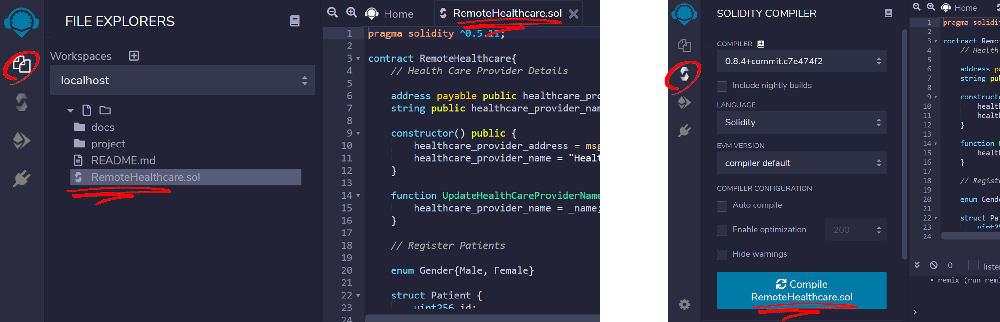

Remote Healthcare System Using Etherium Blockchain
=======================================================
A demo project that uses Etherium smart contracts to manage a remote healthcare system on Etherium Blockchain. For simplicity the system has only 3 types of entities:
1. **Healthcare Provider (HCP)** : A proxy for the smart contract. The address of the Etherium smart contract will be assigned to the HCP. Each registered Doctor, Patient will be subscribed to a HCP. The HCP is responsible for assigning a doctor to a medical case created by the patient.
1. **Doctor** : Each doctor needs to specify the address of a HCP during signup. This ensures the doctor is bound to the corresponding smart contract. A doctor is assigned cases by the HCP and is responsible for diagnosing cases assigned to him/her. To aid the doctors, the medical history of the patient will be made available as long as the case is open and assigned to this specific doctor.
1. **Patient** : Each patient needs to specify the address of a HCP during signup. Patients have the functionality to create new cases and specify their symptoms. The patient's medical history will be stored on the blockchain and made accessible to the doctor assigned to the patient's case. Access to the patient's medical history will be revoked once the case is resolved.


## Prerequisites

1. **Ganache** : An Etherium development environment that serves as a sandbox for deploying and testing your Etherium smart contracts. Think of this as your personal (simulated) blockchain.
2. **Remix IDE** : A web-based IDE for compiling and deploying Etherium smart contracts on ganache.

#### Installing and running Ganache
Assuming npm is installed, run the following command to install ganache on your system:
```
$ npm install -g ganache-cli
```

To run ganache, run the following command:
```
$ ganache-cli -a 10
```
Here `-a` or `--accounts` option allows you to initialize an Etherium sandbox with 10 accounts. These accounts and their corresponding addresses will be used to create doctor and patient accounts in our HCP system.

Once ganace is up and running, IP address (localhost for the demo) and the port will be displayed.
```
Listening on 127.0.0.1:8545
```
We will use this to connect Remix IDE to our local Etherium sandbox.

[Link](https://www.npmjs.com/package/ganache-cli) to complete ganache documentation.

#### Installing and running Remixd
Remix IDE is a web-based IDE and can be accessed using the following URL ([http://remix.ethereum.org/](http://remix.ethereum.org/)). By default, the IDE won't be able to access your local runtime and the project files stored in your local directory. To enable this we first need to install Remixd using the following command to allow for a websocket connection between Remix IDE and your local computer:
```
$ npm install -g @remix-project/remixd
```

To run remixd, on a separate command prompt run:
```
$ remixd -s <shared folder>
```

Here the `<shared folder>` should point to the local repository of this project on your local computer. Once you terminate remixd (using `CTRL + D`), Remix IDE will no longer have access to your local directory.

[Link](https://www.npmjs.com/package/@remix-project/remixd) to complete ganache documentation.

#### Connecting Remix IDE to localhost

For remix to be able to connect to your ganache sandbox:
1. Open the ***File Explorers*** tab on Remix IDE
1. Under workspaces, select `- connect to localhost -` option.
1. Press the connect button on the popup.
In case the connection fails, ensure remixd is running on your computer. Once Remix is connected you will be able to see the project files in the workspace section of the IDE.


#### Configuring Web3 Provider on Remix IDE

To enable remix to compile your smart contracts go to the ***Plugin Manager*** tab of the IDE and ensure the following plugins are activated:
* Solidity Compiler
* Solidity Compiler Logic

If Remix IDE is connected to your local computer, Remixd and Slither will also be displayed as active plugins in the Remix ***Plugin Manager***.

Next, to deploy your smart contract first open the ***Deploy & Run Transactions*** tab and select `Web3 Provider` as your Environment. In case Web3 is unable to connect, open Remix IDE using **http** ([http://remix.ethereum.org/](http://remix.ethereum.org/)) and not **https** in Chrome browser. Once connected you will be able to see the accounts created in your Etherium blockchain sandbox at the time of starting `ganache-cli`.

Next, we will open and compile our smart contract.


#### Compiling and deploying your smart contract using Remix IDE

To compile our smart contract (i.e. RemoteHealthcare.sol) first open it in ***File Explorers*** tab. Double click RemoteHealthcare.sol. Now in the ***Solidity Compiler*** tab, click `Compile RemoteHealthcare.sol` button to compile the smart contract.

Next, we need to deploy this compiled smart contract on the Etherium sandbox. Once compiled the smart contract will be assigned an address.



To deploy the smart contract open ***Deploy & Run Transactions*** tab, ensure `RemoteHealthcare - RemoteHealthcare.sol` is select as the contract and select the `Deploy` button.  Once deployed, you can copy the address of the smart contract. This address will be assigned to the HCP system.

**Note**: The account used to deploy this smart contract will be assigned the role of the Admin.


Congratulations, now you can start using the HCP app using the HTML Web UI.

**Note**: If any changes are made in the RemoteHealthcare.sol smart contract, the corresponding ABI needs to be copied to `project/contract_script.js` file. Use https://www.freeformatter.com/json-escape.html to escape the json.


## Project Guide
The project specific files are in the ***[project](project)*** directory. To start using the app, open **index.html**. You will be redirected to the login page. Here enter the smart contract address and the account address used to deploy the smart contract.

<p align="center">
  
</p>

You will see that no patients or doctors are currently registered to this HCP. Log out from the HCP account to add doctors and patients to this HCP app.

<p align="center">
  
</p>

### Creating accounts (Doctors and Patients)
On login.html under **Registered as section** click on `Patient` or `Doctor` to create patient or doctor accounts respectively. Depending on the role of the account, the user will be redirected to his homepage.


As new patients and doctors are registered with the smart contract address, the HCP panel will reflect their respective details.


### Creating a new case
A patient has the functionality to create a new medical case. To do so,
1. Login with the patient's account.
2. Click the `Add Case` button.
3. Fill out the case details in the popup window and submit.

<p align="center">
  
</p>

### Assigning open cases
As soon as a new medical case is created, the health care provider has access to the details of this case. The HCP can assign open cases to doctors registered with the HCP. To assign an open case to a doctor,
1. Login with the HCP account and click the `Open Cases` tab.
2. For each case select the Doctor from the drop-down list.
3. Click the `Assign` button to assign the case.

<p align="center">
  
</p>

### Diagnosing assigned cases
Once the case has been assigned, the respective doctor will have access to the patient's medical history (i.e. previous cases) and also the details of the current case. Based on this info the doctor can provide his diagnosis. To do this,
1. Login to the doctor's account and click the `Diagnose` button in the **Open Cases** section.
2. Fill in the details of the diagnosis, select appropriate fees from the drop-down menu and submit.


<p align="center">
  
</p>

### Making payments
Once the case has been diagnosed, the patient can make the payments. The corresponding amount will be deducted from the patient's Etherium balance. To do so,
1. Login with the patient's account and click the `Pay` button in the **Open Cases** section.

<p align="center">
  
</p>

Once the payment has been made, a small fee will be credited in the HCP's wallet and the rest of the amount will be credited to the respective doctor's wallet. All the transactions can be viewed by the HCP in the `Transactions` tab.

<p align="center">
  
</p>

### Additional details
In addition to the functionalities mention above the **patient** can also,
* Update his/her details.
* View his/her medical history.

Similarly, the **doctor** can also update his/her details.
